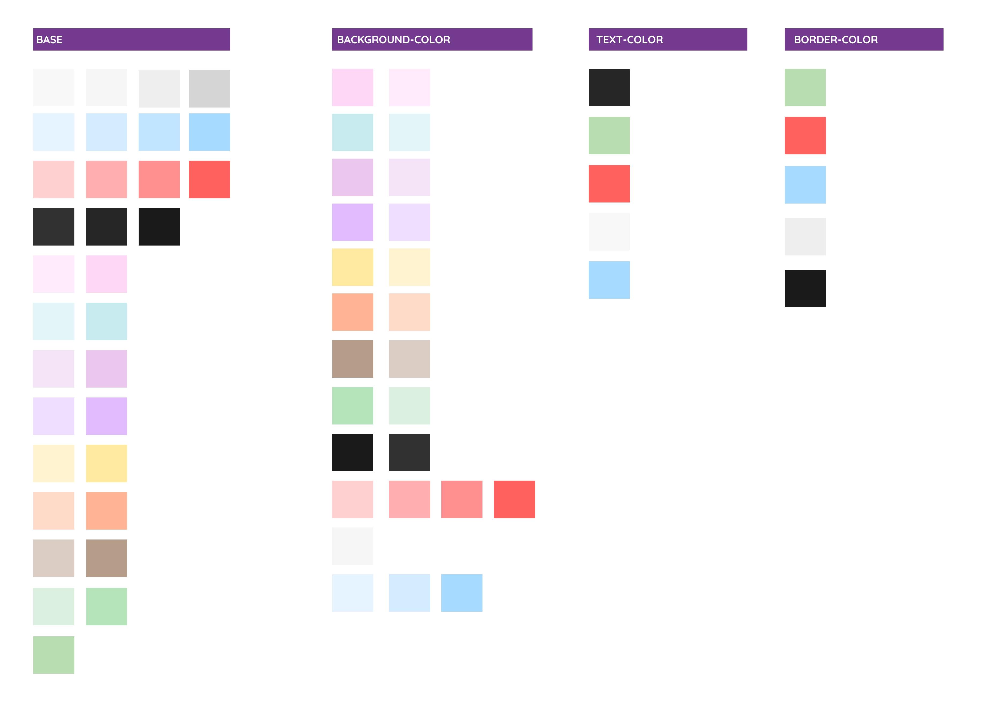
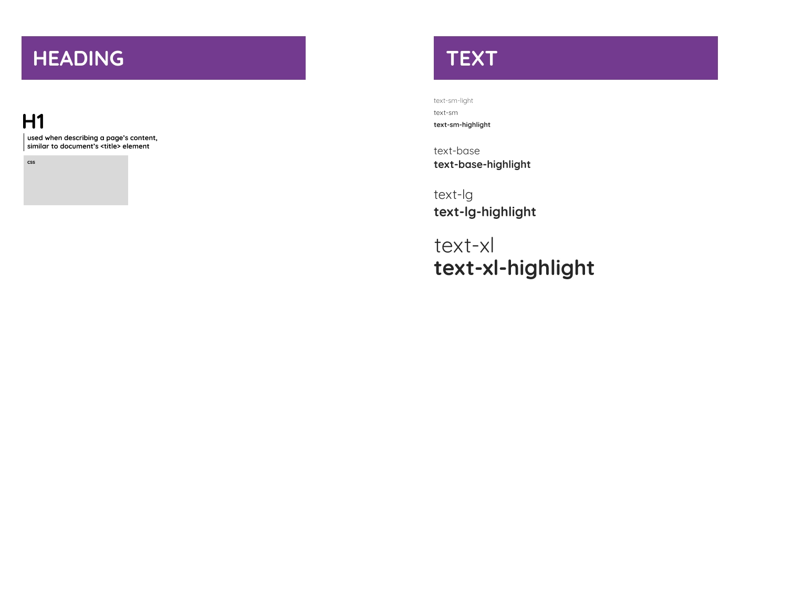
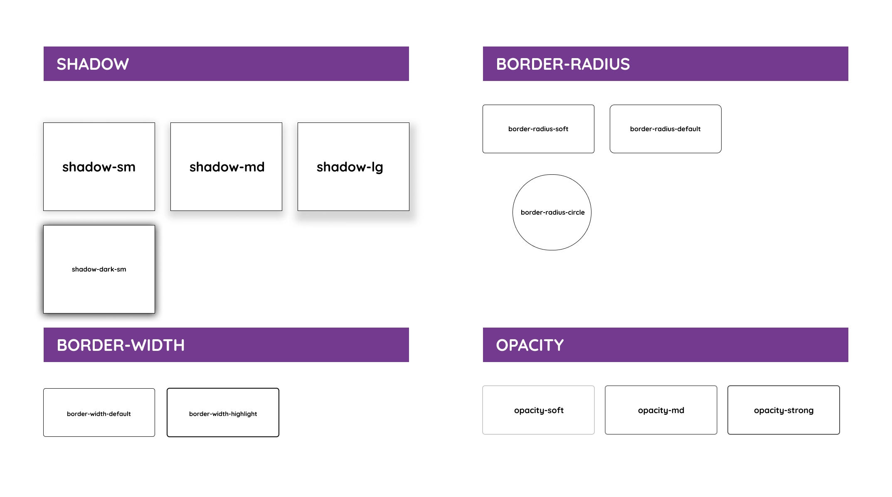

## [Figma](https://www.figma.com/design/s9HB9I0wyGOTvnlWuWkOu6/yoko-?node-id=0-1&t=QBeoAmwyvJ2a6apC-1)

## Design tokens

They are separated by:

### Colors

The base colors are the primary colors of the application, and they will be used to build the semantic tokens which are background-color, text-color and border-color.

### Typography

The Yoko main font family is Quicksand.

### Effects

### Breakpoints
